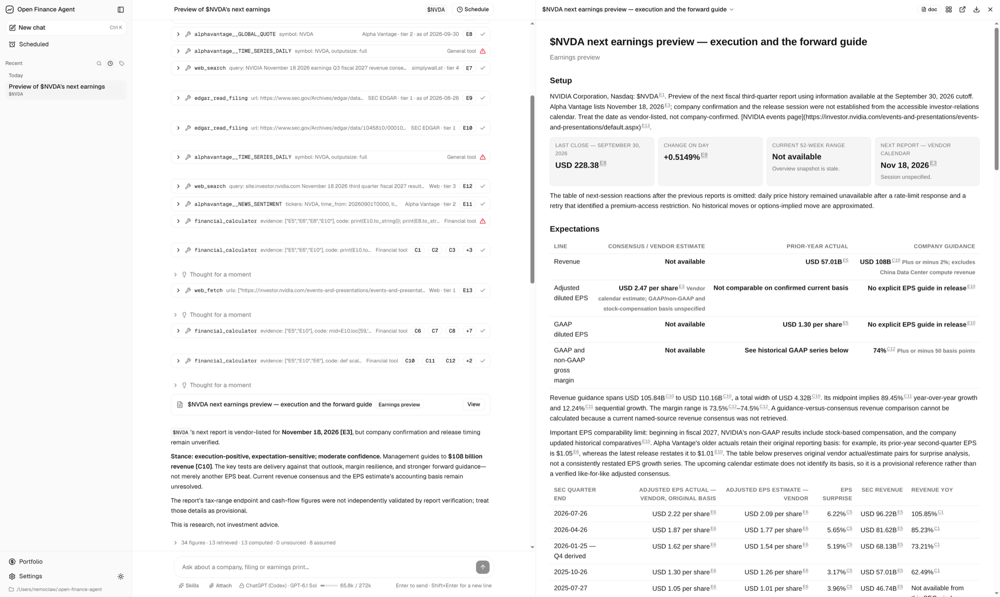
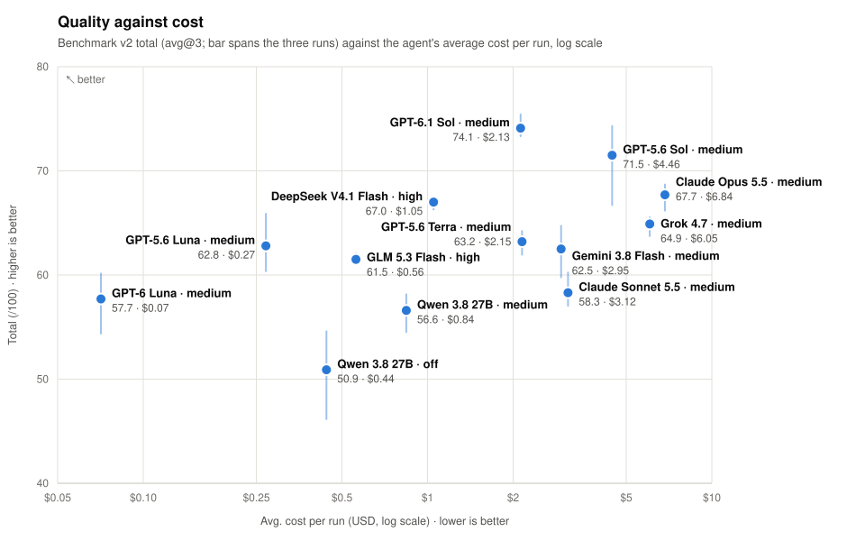

# Open Finance Agent

<p>
  <a href="LICENSE"></a>
  <a href="https://github.com/nemofq/open-finance-agent/actions/workflows/ci.yml"></a>
  
  
</p>

<p align="center">
  <a href="docs/images/screenshot.png"></a>
</p>

**Open Finance Agent is a harness built for financial research and analysis**, similar to
[ChatGPT for Financial Services](https://openai.com/index/introducing-chatgpt-financial-services/)
and [Claude for Financial Services](https://www.anthropic.com/news/claude-for-financial-services),
but open source and running on your own machine. It supports BYOK, so you can use the AI
subscriptions you already have, and lets you add your own data sources and skills.

We believe what sets one harness apart from another is what it **ENFORCES** and what it
**PRIORITISES**. So we carefully crafted the loop, and everything around it, to make four things
hold:

- **Trusted sources come first.** Research draws on professional data such as SEC EDGAR filings,
  Alpha Vantage and any MCP server, and every source carries a trust tier, from 1 for filings to 4
  for the open web. The open web is only a fallback, and a number backed by the web alone is
  flagged as unverified.
- **The model does no mental math.** It writes Python against a purpose-built finance library, and
  an isolated sandbox runs it, so every derived number is computed, not predicted token by token.
- **Every number traces back to its source.** Each number in an answer or report is recorded in a
  ledger as retrieved, computed, given by you or explicitly assumed, with its source, tier and
  as-of date. The calculator reads its inputs from the ledger by id, and our context compaction
  keeps every number tied to its entry, so long-horizon research stays exact.
- **Reports are built for finance.** A dedicated report tool turns research into a clean document
  or slide deck in HTML. Hover over any number to see where it came from, and every report closes
  with its sources, assumptions and a disclaimer.

> Research tool, not investment advice. See the [disclaimer](#disclaimer).

## What it does

Ask the way you would ask an analyst. The agent plans the steps, gathers the data, computes, and
delivers a report.

- **Review an earnings print.** "NVIDIA beat, so why did the stock fall?" It reads the earnings
  release, compares results with estimates and the new guidance with the old, measures the market's
  reaction, and writes an earnings review.
- **Value a company.** "Is Intel cheap, or a value trap?" It builds the free cash flow history from
  filings, derives a discount rate from Treasury yields and the stock's beta, runs a DCF with a
  sensitivity grid and a multiples cross-check, and shows the growth the current price implies.
- **Build a thesis.** "Nuclear power for AI data centres: which stocks actually benefit?" It
  separates producers with signed data-centre power deals from uranium miners and pre-revenue
  reactor start-ups, weighs the evidence on each, and lays out a thesis with a stance and the risks
  that would break it.
- **Fact-check a claim.** "A post says Berkshire is dumping Apple. Is that true?" It checks the
  claim against Berkshire's own filings and separates what was reported from what is speculation.
- **Compare rivals.** "Compare NVIDIA, AMD and Intel over the last eight quarters." It lines up
  revenue, margins and EPS for each, and the numbers stay exact through every follow-up.
- **Know your portfolio.** Import holdings across accounts from a CSV, an `.xlsx` workbook or a
  pasted table, then ask "Am I too concentrated?" to have them checked against your investor
  profile.
- **Keep watch.** Schedule "Every Monday, brief me on my watchlist" to run on its own, continuing
  the same chat or starting a new one each time.

## Quick start

Requires Node 24+ and [pnpm](https://pnpm.io/installation) 12+. `pnpm install` also downloads the
calculator's Python packages (~30 MB, verified by SHA-256).

```bash
git clone https://github.com/nemofq/open-finance-agent.git
cd open-finance-agent
pnpm install
pnpm dev
```

Open http://localhost:3000 and:

1. **Settings › LLM.** Add a provider: sign in to a subscription, paste a key, or point at an
   endpoint. Validate, Test, Save, then choose a default model.
2. **Settings › Data connections.** Enable the connections you need and give each what it asks
   for. SEC EDGAR and Market Quotes are on by default; EDGAR needs a contact string, which the SEC
   requires, and Alpha Vantage needs an API key.
3. **Settings › General tools.** Optionally add a Tavily key for web search.

Then start a chat and ask your first question, or type `/` to pick a skill.

Settings, chats and holdings live in `~/.open-finance-agent`; set `OFA_HOME` to move them.
[docs/usage.md](docs/usage.md) covers every setting in detail.

## Under the hood

### Concerns: the loop, organised by intent

Customising an agent loop means answering two questions at once. Product asks *what must hold*:
no figure reaches the user without a source. Engineering asks *where it happens*: before a tool
call, after it, or when the model wants to stop. Code organised around one question hides the other.

So every customisation is a **concern**: one file, one intent, implementing only the hook points
that intent needs out of the loop's fifteen. `compose()` weaves the concerns into a single loop in a
fixed order. Each file reads as an intent; the composition reads as the loop.

`policy` enforces the standards a careful analyst holds to: trusted sources before the open web,
no personal data sent out, no stale or future-dated data passing unnoticed, no figure without a
source. It spans five points, and the point sets how firmly it acts:

```ts
// src/lib/harness/policy.ts, bodies elided
export const policy = (rules: RuleContext): Concern => ({
  name: "policy",
  beforeTurn,    // Bind the turn, so every verdict lands in its check record
  toolIssued,    // Count each call the model issues, before any check
  beforeTool,    // Block: a web search a data connection covers, personal data leaving, a repeat call
  afterTool,     // Annotate: a stale quote, sources that disagree, data dated after the cutoff
  beforeRunEnd,  // Follow up or flag: unsourced figures, figures only the web backs, advice wording
});

// src/lib/agent/factory.ts, simplified: the loop is its concerns, in order
compose([execution, time, capabilities, user, attachments, conduct, evidence, delivery, policy, compaction, view]);
```

All fifteen hook points, and the rules that keep concerns small, are in
[docs/architecture.md](docs/architecture.md#the-concern-contract).

### A benchmark that favours quality over quantity

A good eval does more than rank. It separates a better model or harness from a worse one, and it
says clearly what to fix. Both come from the quality of the cases, not their number, so we
hand-crafted twelve, covering real 2024 retail-investor situations from earnings surprises and
value traps to leveraged proxies, auditor red flags and portfolio fit, with a pinned offline
dataset of the filings, prices and web pages that were public at each task's cutoff.

Every task runs through the same loop as a chat. Eval v2 computes deterministic integrity directly
out of 40 points (required evidence, figure support and task contracts). Answer quality keeps the
existing 60-point judge verdict unchanged; an
item-level semantic rubric is being developed separately. Completion rate, quality on completed
answers, and expected user score are reported independently.

<picture>
  <source media="(prefers-color-scheme: dark)" srcset="docs/images/benchmark-quality-cost-dark.svg" />
  
</picture>

| Model | Thinking effort | Judge model | Total (/100) ↑ | Checks (/40) ↑ | Judged (/60) ↑ | Avg. cost per run ↓ | Avg. run time | Avg. output tokens per run | Avg. tool calls per run |
| :--- | :--- | :--- | ---: | ---: | ---: | ---: | ---: | ---: | ---: |
| GPT-6.1 Sol avg@3 | Medium | GPT-6 Astra, medium | 84.8 | 35.8 | 49.0 | $2.13 | 1,696 s | 37,347 | 224 |
| DeepSeek V4.1 Flash avg@3 | High | GPT-6 Astra, medium | 77.3 | 39.1 | 38.1 | $1.05 | 2,119 s | 453,144 | 452 |
| GPT-6 Luna avg@3 | Medium | GPT-6 Astra, medium | 67.6 | 29.8 | 37.8 | $0.07 | 516 s | 19,198 | 134 |
| Qwen 3.8 27B avg@3 | Medium | GPT-6 Astra, medium | 65.4 | 35.2 | 30.2 | $0.84 | 1,685 s | 239,026 | 202 |
| Qwen 3.8 27B avg@3 | Off | GPT-6 Astra, medium | 59.4 | 33.6 | 26.8 | $0.44 | 835 s | 100,714 | 216 |

↑ higher is better, ↓ lower is better. Benchmark version 1, policy enforced. `avg@3` is the mean of
three runs of the twelve tasks. Run time counts the model's turns, not judging. Cost is the agent's,
not the judge's, at the provider's list prices on 2026-10-01, from the tokens the provider reported.
This historical v1 table and chart must not be compared directly with v2 scores.
Each row is a committed baseline, with its per-task scores and the prices used in
[evals/baselines/README.md](evals/baselines/README.md), and the tasks, the scoring, how cost is
calculated and how to reproduce a run are in [evals/README.md](evals/README.md).

## Features

| Area | In this version |
| :--- | :--- |
| **Models** | Anthropic (API key, or Claude Pro/Max sign-in, experimental), OpenAI (API key, or ChatGPT sign-in), GitHub Copilot, Google Gemini, xAI, DeepSeek, OpenRouter, OpenCode Zen and Go, any OpenAI-compatible endpoint; about 25 more from pi-ai under More providers, from Mistral and Groq to Bedrock, Vertex AI and Azure |
| **Data** | SEC EDGAR, Market Quotes, Alpha Vantage, any MCP server; Tavily web search as a fallback |
| **Calculator** | Python sandbox with numpy, pandas, scipy and a finance library (DCF, WACC, IRR, risk, options) |
| **Reports** | HTML documents and slide decks, eight finance templates |
| **Skills** | Eight bundled research workflows; add your own as a `SKILL.md` |
| **Attachments** | Send the model PDF, Word, PowerPoint, Excel, CSV and text files, and images on models that see them |
| **Portfolio** | Holdings across accounts, imported from CSV, `.xlsx` or a pasted table |
| **Also** | Investor profile, memory, scheduled tasks, context compaction |

How these fit together is in [docs/architecture.md](docs/architecture.md).

## Roadmap and contributing

What comes next, in rough order:

- More data connections.
- More skills for everyday research workflows.
- More high-quality benchmark cases, and self-improvement: the harness using the benchmark to
  improve itself.
- The tools users ask for.
- A desktop app.

Contributions are welcome through pull requests, and most of this list is a good place to start:
data connections, skills and tools each have a recipe in [docs/extending.md](docs/extending.md),
and a benchmark task starts as an issue. [CONTRIBUTING.md](CONTRIBUTING.md) covers the checks,
where each change goes and how to open a pull request.

## Security

Open Finance Agent is built for one user on their own machine, and its API has no login: its only
guard refuses writes that another website sends through your browser, so anyone who can reach the
port can run the agent on your keys and read your data. Do not expose it to a network. Keys and
sign-in tokens are stored in `config.json` and `auth.json`, readable only by you
([data folder](docs/usage.md#data-folder-and-privacy)). Report a vulnerability privately through
the repository's Security tab › Report a vulnerability, never in a public issue.

## Disclaimer

This is a research tool. It retrieves, summarises and analyses public financial data and relates
it to the profile you entered. It does not give investment advice, and nothing it produces is a
recommendation to buy or sell anything. Language models make mistakes, including confident ones,
and data providers have outages, delays and revisions. Every number carries its source: check the
ones that matter before you act on them.

## Acknowledgements

Built on these open-source projects:

- [pi-agent-core](https://github.com/earendil-works/pi/tree/main/packages/agent): the minimal
  agent loop our concerns hook into.
- [pi-ai](https://github.com/earendil-works/pi/tree/main/packages/ai): one API for every model
  provider.
- [Pyodide](https://github.com/pyodide/pyodide) and [Deno](https://github.com/denoland/deno): the
  calculator sandbox.
- [NumPy](https://github.com/numpy/numpy), [pandas](https://github.com/pandas-dev/pandas),
  [SciPy](https://github.com/scipy/scipy) and
  [statsmodels](https://github.com/statsmodels/statsmodels): the calculator's math.
- [MCP TypeScript SDK](https://github.com/modelcontextprotocol/typescript-sdk): MCP servers.
- [PDF.js](https://github.com/mozilla/pdf.js), [mammoth](https://github.com/mwilliamson/mammoth.js)
  and [ExcelJS](https://github.com/exceljs/exceljs): attachments.

## License

MIT. See [LICENSE](LICENSE).
